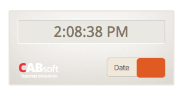
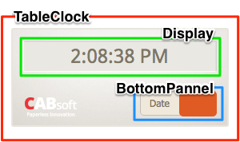

#Kakera

## 소개
**Kakera**는 Web browser에서 동작하는 JavaScript framework이며 [SPA(Single-page application)](https://en.wikipedia.org/wiki/Single-page_application)의 원칙을 채용하였으며 현재 유행하는 SPA framework인 [React](https://facebook.github.io/react/)처럼 MVC패턴 중 V(View)만을 담당하도록 설계되어 있다. 

**Kakera**의 특장점은 다음과 같다.

1. MVC 패턴 중, View만을 담당한다.
2. 보다 손쉽게 Javascript에서 [OOP(Object-oriented programming)](https://en.wikipedia.org/wiki/Object-oriented_programming)를 활용할 수 있다.
3. Web Page의 DOM을 Component화 하기 때문에 [CBD(Component-Based Development)](https://en.wikipedia.org/wiki/Component-based_software_engineering)가 가능해진다.
4. 작성한 Component를 매우 쉽게 [Composite pattern](https://en.wikipedia.org/wiki/Composite_pattern) 구성할 수 있으며, 재사용성이 뛰어나다.
6. AngularJS처럼 전용 모듈을 사용하지 않아도 되므로, legacy javascript code와 호환이 가능하다. 물론, IE8에서도 동작한다.
8. OOP의 개념을 숙지하고 있는 개발자라면 learning cost가 적게 든다.
9. 이미 작성한 코드를 다른 SPA로의 마이그레이션이 용이하다.

## 시작하기
[Start-Kit](https://github.com/dotNetTree/KakeraStaterKit/archive/master.zip)을 받은 후 `app`폴더 밑에 hellokakera.html을 만들어보자.

```
<!doctype html>
<html>
	<head>
		<meta charset="utf-8">
		<title>Hello Kakera~!</title>
		<script scr="kakera/KakeraDOM.js"></script>
	</head>
	<body>
		<div id="injectTarget"></div>
		<script type="text/javascript">
			var ComponentCls = KakeraDOM.createClass("Helloworld", {
				template: "<h1>Hello, Kakera~!</h1>"
			});
			KakeraDOM.render(
				new ComponentCls(), 
				document.getElementById("injectTarget")
			);
		</script>
	</body>
</html>

```
여기에서 KakeraDOM.createClass에 의해 생성된 Function을 **Component Class**라 부르며 이를 활용하여 복잡하고 다양한 화면과 기능을 구현할 수 있게 된다.

## 튜토리얼
대략적인 Kakera 프레임워크의 흐름을 배우기 위해 간단한 튜토리얼을 해보기로 하자.
튜토리얼의 주제는 "탁상시계"이다. 이해를 돕기 위해 아래 그림을 보기로하자.



우리는 이 탁상시계를 다음과 같이 분해를 할 것이다.



분해한 component structure는 다음과 같이 된다.

```
TableClock
└── Display
└── BottomPannel
```


본격적인 튜토리얼에 들어가기 앞서 받은 Start-Kit의 `app`폴더에 table_clock.html을 만든 후 다음과 같이 작성한다.

```
<!DOCTYPE HTML>
<html lang="ko">
<head>
<title>탁상시계</title>
<meta http-equiv="Content-Type" content="text/html; charset=utf-8" />
<meta http-equiv="Content-Script-Type" content="text/javascript" />
<meta http-equiv="Content-Style-Type" content="text/css" />
<meta http-equiv="X-UA-Compatible" content="IE=9" />
<meta name="viewport" content="width=device-width, initial-scale=1.0, user-scalable=no">
<link rel="stylesheet" type="text/css" href="styles/css/starter.css">
</head>
<body>
	<div id="tableClock"></div>
</body>
</html>
```

#### 메인 컴포넌트 작성
여기에서 KakeraDOM.js를 로드하고 탁상시계 컴포넌트를 작성한 후, id가 tableClock인 div에 주입(injection)을 한다. 

```
 ...
 <div id="tableClock"></div>
 <script src="kakera/KakeraDOM.js"></script>
 <script>

 // 1
 var TableClock = KakeraDOM.createClass("TableClock", {
	template:
	"<div>\
		탁상시계\
	</div>"
 });

 // 2
 KakeraDOM.render(
	new TableClock(),
	document.getElementById("tableClock")
 );

 </script>
 ...

```

1번에서 KakeraDOM.createClass로 component class를 생성하게 되는데 첫번째 argument는 `classAlias`라 부르며, composite pattern 구성과 debug시 사용된다. 두번째 argument는 `spec`이라 부르며, component class의 spec을 정의한다. 2번에서는 1번에서 생성된 TableClock class를 인스턴스화 하여 타겟(id="tableClock")에 "&lt;div>탁상시계&lt;div>"를 주입하게 된다.

#### 컴포넌트 합성
이제 TableClock의 child component를 생성하여 합성을 해보자.

```
 ...

 // 1
 var Display = KakeraDOM.createClass("Display", {
	template:
	"<div>\
		디스플레이\
	</div>"
 });
 
 // 2
 var Pannel = KakeraDOM.createClass("BottomPannel", {
	template:
	"<div>\
		하단패널\
	</div>"
 });
 
 // 3
 var TableClock = KakeraDOM.createClass("TableClock", {
 	deps: [Display, Pannel],
	template:
	"<div>\
		<Display />\
		<BottomPannel />\
	</div>"
 });

 ...

```
1번에서 상단부에 해당하는 `Display` component class를 생성한다. 그리고, 2번에서 하단부에 해당하는 `BottomPannel` compnent class를 생성한다.
이번에 main component에 해당하는 TableClock에 `deps`라는 spec이 추가가 되었는데, 이는 template을 사용된 custom element가 상단에서 정의한 component class에 해당함을 정의한다. 주의해야 하는 부분은 template에 정의할 때, 반드시 component class에 해당하는 변수명이 아닌 **`classAlias`**로 해야한다.

#### 디자인 입히기
이미 정의해놓은 css를 활용하여 디자인을 입힌다. 이 튜토리얼은 css에 대한 튜토리얼이 아니므로 설명은 생략한다.

```
 ...

 var Display = KakeraDOM.createClass("Display", {
	template:
	"<div class='display'>\
	</div>"
 });
 
 var Pannel = KakeraDOM.createClass("BottomPannel", {
	template:
	"<div class='bottom-pannel'>\
		<span></span>\
		<ul>\
			<li>\
				<a href='javascript:void(0);'>Date</a>\
			</li>\
			<li>\
				<a href='javascript:void(0);'>Time</a>\
			</li>\
		</ul>\
	</div>"
 });
 
 var TableClock = KakeraDOM.createClass("TableClock", {
 	deps: [Display, Pannel],
	template:
	"<div class='clock-wrap'>\
		<h1></h1>\
		<Display />\
		<BottomPannel />\
	</div>"
 });

 ...

```

#### props 사용 (1)
Kakera framework는 마치 facebook의 React.js처럼 props를 사용할 수 있는데, 
탁상시계가 화면에 등장시 디스플레이에 initialize 문자열을 TableClock에서 설정하여 보여주도록 하자.

```
 ...

 var Display = KakeraDOM.createClass("Display", {
	template:
	"<div class='display'>\
	</div>",
	willMount: function () {	// 1
		this.el.innerText = this.props.initText;
	}
 });
 
 ...
 
 var TableClock = KakeraDOM.createClass("TableClock", {
 	deps: [Display, Pannel],
	template:					// 2
	"<div class='clock-wrap'>\
		<h1></h1>\
		<Display initText='Booting...'/>\
		<BottomPannel />\
	</div>"
 });

 ...

```
1번에서 this.props가 등장하는데 2번의 custom element의 attribute가 해당 component의 props가 된다. 그리고, 1번의 willMount function은 document에 append되기 직전에 불리우는 function이며 this.el은 template을 element화 한 객체이다.

#### 외부 라이브러리 사용
지금 작성하고 있는 튜토리얼은 시계이므로 1초에 한번씩 현재시간을 알려주는 tick으로 알려주는 모듈이 필요하다. 이 모듈은 이미 starter-kit에 들어있으므로 라이브러리를 추가하고 사용해보자.

```
 <script src="kakera/KakeraDOM.js"></script>
 <script src="js/convenience/Ticktock.js"></script> // 1
 <script>
 ...
 var TableClock = KakeraDOM.createClass("TableClock", {
 
 	_tick: function (dateAndTime) {		// 2
 		console.log(dateAndTime);
 	},
 	deps: [Display, Pannel],
	template:
	"<div class='clock-wrap'>\
		<h1></h1>\
		<Display initText='Booting...'/>\
		<BottomPannel />\
	</div>",
	init: function () {					// 3
		this._ticktock = new Ticktock();
		this._ticktock.start(this._tick.bind(this));
	},
	destroy: function () {				// 4
		this._ticktock.stop();
	}
	
 });
 ...
```
1번에서'Ticktock'이라는 외부 라이브러리 모듈을 불러온다. 이 모듈은 start function실행시 설정한 callback 으로 1초에 한번씩 date와 time을 넘겨준다. 2번은 Ticktock 모듈로부터 date와 time을 넘겨받을 callback function을 설정한다. 3번은 component class가 인스턴스화 될 때 실행되는 initialize function이다. 여기에서 Ticktock의 인스턴스를 생성하고 실행을 시킨다. 4번의 destroy는 component가 제거가 될 경우 호출되는데, ticktock을 stop 시키도록 하는 코드를 넣지 않으면 component가 제거된 후에도 계속 tick이 발생하게 된다. 
> **Note:**<br>
> 4번의 destroy는 component의 release function에 의해 호출되므로 **직접 호출해선 안된다**.

#### props 사용 (2)
props 사용 (1)에서는 데이터를 다른(child) component로 전달하는 것을 하였는데 이번에는 function을 전달해보도록 하겠다. 현재 ticktock으로 부터 tick을 TableClock이 받고 있는데 이것을 Display로 전달하기 위해 다음과 같이 작업을 한다.

```
 ...
 
 var Display = KakeraDOM.createClass("Display", {
	template:
	"<div class='display'>\
	</div>",
	init: function () {		// 1
		this._removeListener = this.props.addListener("ticktock", function (dateAndTime) {
			console.log(dateAndTime);
		}.bind(this));
	},
	willMount: function () {
		this.el.innerText = this.props.initText;
	},
	destroy: function () {	// 2
		this._removeListener();
		this._removeListener = null;
	}
 });
 
 ...
 
 var TableClock = KakeraDOM.createClass("TableClock", {
 
	addListener: function (type, listener) {
		this._listener[type] = this._listener[type] || [];
		this._listener[type].push(listener);
		
		return function () {
			this.removeListner(type, listener);
		}.bind(this);
	},
	removeListener: function (type, listener) {
		if (this._listener[type]) {
			for (var i = 0; i < this._listener[type].length; i++) {
				if (this._listener[type][i] === listener) {
					this._listener[type].splice(i, 1);
					break;
				}
			}
		}
	},
	_tick: function (dateAndTime) {
		if (this._listener["ticktock"]) {
			for (var i = 0; i < this._listener["ticktock"].length; i++) {
				this._listener["ticktock"][i](dateAndTime);
			}
		}
	},
 	deps: [Display, Pannel],
	template:	// 3
	"<div class='clock-wrap'>\
		<h1></h1>\
		<Display initText='Booting...'\
				 addListener={this.addListener}/>\
		<BottomPannel />\
	</div>",
	init: function () {
		this._listener = {};
		this._ticktock = new Ticktock();
		this._ticktock.start(this._tick.bind(this));
	},
	destroy: function () {
		this._ticktock.stop();
	}
	
 });
 ...
```
먼저 3번의 template을 보면 Display component에 addListener가 설정되어 있음을 알 수 있다. 자기자신(TableClock)의 무언가를 다른(자식) component로 전달 할 시에는 `{}`를 사용하면 된다. TableClock은 Display로 addListener를 전달하여 listener를 설정할 수 있도록 해주고, _tick을 수정하여 Display에서 설정된 listener로 결과를 전달 하도록 수정 하였다. 그리고, Display component가 제거될 때 listener 또한 삭제를 해줘야 하므로 2번과 같이 destroy에 removeListener를 호출 하도록 하였다.

#### 이벤트 listener 추가
BottomPannel에는 주황색 토글 버튼이 존재한다. 이 버튼에 이벤트를 추가해보도록 하겠다.

```
...
 var Pannel = KakeraDOM.createClass("BottomPannel", {
	template:
	"<div class='bottom-pannel'>\
		<span></span>\
		<ul>\
			<li>\
				<a href='javascript:void(0);'>Date</a>\
			</li>\
			<li>\
				<a href='javascript:void(0);'>Time</a>\
			</li>\
		</ul>\
	</div>",
	listener: {		// 1
		"click span": function (e) {
			console.log('버튼이 눌렸다.');
		}
	}
 });
...
```
1번은 listener라는 component class의 spec중 하나이다. event listener를 설정할 때 사용한다. 
> **Note:**<br>
> listener의 key는 event명+공백+css selector 형태로 만들어야 하며 value는 envent callback function을 설정해주어야 한다.

#### props의 사용 (3)
이번엔 BottomPannel에서 이벤트를 부모인 TableClock으로 전달해보도록 하겠다.

```
...
 var Pannel = KakeraDOM.createClass("BottomPannel", {
	template:
	"<div class='bottom-pannel'>\
		<span></span>\
		<ul>\
			<li>\
				<a href='javascript:void(0);'>Date</a>\
			</li>\
			<li>\
				<a href='javascript:void(0);'>Time</a>\
			</li>\
		</ul>\
	</div>",
	listener: {					// 1
		"click span": function (e) {
			this.props.modeToggle();
		}
	}
 });
 
  var TableClock = KakeraDOM.createClass("TableClock", {
 
 	onModeToggle: function () {	// 2
 		console.log("토글됨!");
 	},
	...
	template:					// 3
	"<div class='clock-wrap'>\
		<h1></h1>\
		<Display initText='Booting...'\
				 addListener={this.addListener}/>\
		<BottomPannel modeToggle={this.onModeToggle} />\
	</div>",
	...
	
 });
 
...
```
TableClock에 2번처럼 버튼의 이벤트를 처리할 function을 정의한 후, 3번처럼 간단히 custom element의 attribute로 전달시키고 1번과 같이 사용한다.

#### 부모에서 자식으로 접근
이번엔 TableClock에서 BottomPannel에 접근하여 BottomPannel의 function을 호출해보도록 하겠다.

```
...
 var Pannel = KakeraDOM.createClass("BottomPannel", {
	btnMoveTo: function (direction) {	// 1
		var elem = this.el.querySelector("span"),
			pos, to, dir;
		
		if (direction === "left") {
			pos = 48;
			to = 0;
			dir = -1;
		} else {
			pos = 0;
			to = 48;
			dir = 1;
		}
		
		var id = setInterval(frame, 5);
		function frame() {
			if (pos === to) {
				clearInterval(id);
			} else {
				pos+=dir;
				elem.style.left = pos + 'px';
			}
		}
	}
 	...

 });
 
  var TableClock = KakeraDOM.createClass("TableClock", {
 	_mode: "time",
 	onModeToggle: function () {	// 2
 		var bPannel = this.children("BottomPannel")[0]; // 3
 		if (this._mode === "time") {
 			this._mode = "date";
 			bPannel.btnMoveTo("left");
 		} else {
 			this._mode = "time";
 			bPannel.btnMoveTo("right");
 		}
 	},
	...
 });
 
...
```
BottomPannel에서는 1번처럼 direction을 받아 버튼을 움직이는 애니메이션을 실행 할 수 있는 function을 작성한다. TableClock에서는 BottomPannel의 인스턴스에 접근하여 직접 1번에 정의한 function을 호출하도록 한다. BottomPannel가 TableClock의 자식이 되므로 this.children으로 모든 자식을 얻을 수 있으며, this.children의 argument로 classAlias를 주면 해당 classAlias의 자식 list를 얻을 수 있다. 이번 튜토리얼에서는 BottomPannel가 한개 밖에 쓰이지 않았기 때문에 0번 index를 참조하였다.

#### 마무리
지금까지 잘 따라왔다면 화면이 여전히 "Booting..." 이라는 문자열이 나올것이다. 이 부분을 고치기 위해 다음과 같이 코드를 수정한다.

```
...
 var Display = KakeraDOM.createClass("Display", {
	template:
	"<div class='display'>\
	</div>",
	init: function () {		// 1
		this._removeListener = this.props.addListener("ticktock", function (dateAndTime) {
			this.el.innerText = dateAndTime;
		}.bind(this));
	},
	...
 });

...

  var TableClock = KakeraDOM.createClass("TableClock", {
 	_tick: function (dateAndTime) {
		if (this._listener["ticktock"]) {
			for (var i = 0; i < this._listener["ticktock"].length; i++) {
				this._listener["ticktock"][i](dateAndTime[this._mode]);// 2
			}
		}
	},
	...
 });
 
...
```
이전까지는 2번에서 리스너로 Object를 넘겨주었는데 이 부분을 mode에 따라 해당하는 문자열을 넘겨주도록 수정하고, 1번처럼 리스너로 들어오는 문자열을 바로 화면에 출력시키도록 수정한다.

## API 문서
작성 중...


## Copyright
Copyright 2015 (C) CABSOFTWARE.COM - All Rights Reserved
